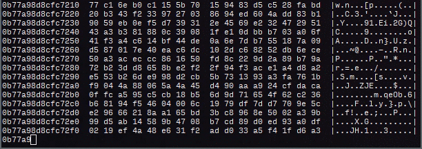
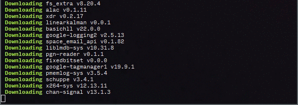

# genact - a nonsense activity generator

**Pretend to be busy or waiting for your computer when you should actually be doing real work!** Impress people with your insane multitasking skills. Just open a few instances of `genact` and watch the show. `genact` has multiple scenes that pretend to be doing something exciting or useful when in reality nothing is happening at all.

## Installation

You don't have to install anything! For your convenience, prebuilt binaries for Linux, OSX and Windows are provided [here](https://github.com/svenstaro/genact/releases) that should run without any dependencies. **Additionally, there is a web version at https://svenstaro.github.io/genact/**

It's compatible with FreeBSD, Linux, macOS, Windows 10 (it needs a recent Windows 10 to get ANSI support) and most modern web browsers that support WebAssembly.

**On FreeBSD**: You don't have to do anything special here. Just run

    pkg install genact
    genact

**On Linux**: Download `genact-linux` from [the releases page](https://github.com/svenstaro/genact/releases) and run

    chmod +x genact-linux
    ./genact-linux

**On macOS**: Download `genact-osx` from [the releases page](https://github.com/svenstaro/genact/releases) and run

    chmod +x genact-osx
    ./genact-osx

A homebrew package is also available. To install it this way, run

    brew install genact

On macOS, you can also install via MacPorts:

    sudo port install genact

**On Windows**: Download `genact-win.exe` from [the releases page](https://github.com/svenstaro/genact/releases) and double click it.

It is also available on Scoop:

    scoop install genact

**With Cargo**: If you have a somewhat recent version of Rust and Cargo installed, you can run

    cargo install genact
    genact

## Running

To see a list of all available options, you can run

    ./genact -h

or

    cargo run -- -h

or (on Docker)

    docker run -it --rm svenstaro/genact -h

### Usage

    genact 1.1.1
    Sven-Hendrik Haase <svenstaro@gmail.com>
    A nonsense activity generator

    USAGE:
        genact [OPTIONS]

    OPTIONS:
            --exit-after-modules <EXIT_AFTER_MODULES>    Exit after running this many modules
            --exit-after-time <EXIT_AFTER_TIME>          Exit after running for this long (format example: 2h10min)
        -h, --help                                       Print help information
        -l, --list-modules                               List available modules
        -m, --modules <MODULES>                          Run only these modules [possible values: kernel_compile, cryptomining, weblog, memdump,
                                                         docker_image_rm, mkinitcpio, download, composer, botnet, rkhunter, simcity, bootlog,
                                                         cargo, cc, ansible, docker_build]
        -s, --speed-factor <SPEED_FACTOR>                Global speed factor [default: 1]
        -V, --version                                    Print version information

### Web usage

In the web version, you can run specific modules by providing them as `?module`
parameters like this: https://svenstaro.github.io/genact?module=cc&module=memdump

You can also provide a `?speed-factor` like this:
https://svenstaro.github.io/genact?speed-factor=5

## Building

You should have a recent version of rust and cargo installed.

Then, just clone it like usual and `cargo run` to get output:

    git clone https://github.com/svenstaro/genact.git
    cd genact
    cargo run --release

## Releasing

This is mostly a note for me on how to release this thing:

- Make sure `CHANGELOG.md` is up to date.
- `cargo release <version>`
- `cargo release --execute <version>`
- Releases will automatically be deployed by GitHub Actions.
- Update Arch package.
